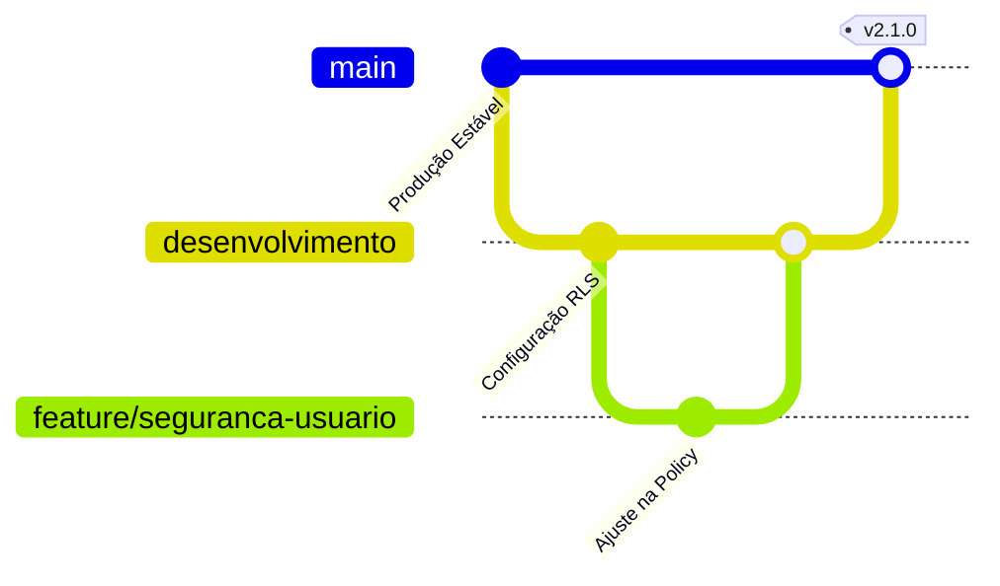

# Fluxo de Trabalho e Guia de Desenvolvimento — SYSBUS 2.0

Este documento descreve a política de branches, os procedimentos de validação de código e as regras de integração para garantir que a branch principal (`main`) permaneça estável, segura e livre de regressões.

---

## 🌿 Política de Branches

Para manter a integridade do código em produção, adotamos o seguinte modelo de ramificação:



1. **`main` (Principal / Produção)**:
   - Contém apenas código homologado, testado e pronto para produção.
   - **Nunca** commit diretamente na `main`.
   - Modificações só entram na `main` via merge da branch `desenvolvimento` após validação completa.

2. **`desenvolvimento` (Integração)**:
   - Branch padrão para integração de novas funcionalidades e correções de segurança.
   - É a base a partir da qual novas branches de features são criadas.

3. **Branches de Feature (`feature/...` ou `bugfix/...`)**:
   - Criadas a partir de `desenvolvimento` para tarefas específicas.
   - Exemplo: `feature/rls-usuario`, `bugfix/janela-enquete`.
   - Ao concluir a tarefa, a branch é mergeada de volta em `desenvolvimento`.

---

## 🛠️ Ciclo de Desenvolvimento e Validação

Siga estes passos obrigatórios para propor qualquer alteração de código:

### Passo 1: Preparação
Antes de iniciar uma alteração, certifique-se de que está na branch correta:
```bash
git checkout desenvolvimento
git pull origin desenvolvimento
git checkout -b feature/nome-da-sua-feature
```

### Passo 2: Implementação e Linting Local
Após fazer as alterações de código, valide as regras de estilo e qualidade utilizando o linter rápido (`oxlint`):
```bash
npm run lint
```
*Garantir que nenhum erro ou warning relevante seja introduzido.*

### Passo 3: Execução de Testes e Simulações
Se as mudanças envolverem banco de dados, alocação de vagas ou Edge Functions, use as ferramentas locais de simulação:
1. Certifique-se de subir as Edge Functions localmente para teste, se necessário:
   ```bash
   supabase functions serve
   ```
2. Execute o teste de carga e simulação de votos na fila ao vivo:
   ```bash
   node scripts/simular-votos.mjs
   ```
3. Limpe os dados de teste gerados para manter o banco limpo:
   ```bash
   node scripts/limpar-testes.mjs
   ```

### Passo 4: Integração em `desenvolvimento`
Quando as alterações estiverem validadas localmente, integre-as na branch `desenvolvimento`:
```bash
git checkout desenvolvimento
git merge feature/nome-da-sua-feature
git push origin desenvolvimento
```

### Passo 5: Promoção para `main` (Produção)
A branch `desenvolvimento` só deve ser mergeada na `main` se:
1. O sistema tiver sido testado em ambiente de homologação (staging/teste).
2. Não houver regressões nas Edge Functions nem no portal do aluno.
3. A integração for aprovada em conjunto pela equipe ou responsável técnico.

Para mesclar em `main`:
```bash
git checkout main
git merge desenvolvimento
git push origin main
```

---

## 🔒 Diretrizes de Segurança Obrigatórias

- **Políticas de RLS**: Qualquer nova tabela no banco de dados **deve** ter Row Level Security (RLS) ativado por padrão.
- **Sanitização no Backend**: Nunca confie que o frontend enviará dados limpos ou válidos. Sempre valide permissões (`papel`, `secretariaId`) e tipos de dados dentro das Edge Functions usando o JWT do usuário autenticado.
- **Dados Sensíveis**: Jamais commit chaves de API, senhas ou strings de conexão no repositório. Utilize arquivos `.env` ou o gerenciador de segredos do Supabase Vault.
